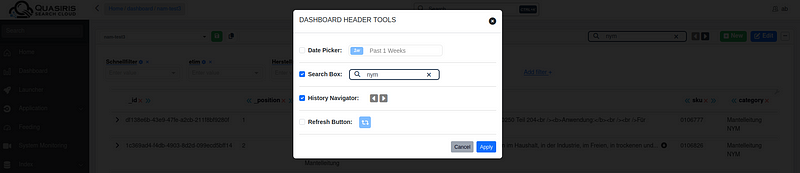

# QSC Dashboard Overview

The QSC Dashboard is a core feature of the **QSC admin platform**, designed to support advanced search analytics and configuration management. It provides a flexible and scalable environment where users can build, organize, and monitor custom dashboards tailored to their specific data and workflow needs.

This feature is particularly suited for teams managing complex search systems, running experiments across datasets, or collaborating across departments. With a focus on modularity and ease of use, the **QSC Dashboard** enables complete control over the analytics interface through interactive widgets, persistent configurations, and streamlined dashboard management.

---

### Key Capabilities

- #### Create Multiple Dashboards
    Easily create and manage **multiple dashboards**, each with unique widgets and configurations. Ideal for managing projects, experiments, or teams.

- #### Seamless Navigation
    Switch between dashboards effortlessly with a **smooth navigation experience**, keeping your workflows efficient and productive.

- #### Full Control Over Widgets
    Customize your dashboards with a variety of **widgets**, including:
    - Charts (bar,donut,...)
    - Inputs (Date picker, search box,refresh button, dropdown,...)
    - Data tables
    - Markdown blocks
    - HTML blocks
    - Open API integrations

    Arrange and configure each widget to **match your data and storytelling needs**.

- ####  Widgets References
    The QSC Dashboard allows you to fine-tune how widgets interact using **Widgets References** — a feature designed to optimize synchronization and improve performance.

    When building dashboards with multiple widgets (e.g. search boxes, charts, filters), it's important that only related widgets respond to each other. **Widgets References** let you group widgets so updates only happen where relevant — this is known as **smart synchronization**.

    Widgets in the same reference group are linked and update together. Others remain independent.

    ```json
    {
    "references": [
        ["searchBox1", "dataTable1", "donutChart1"],
        ["datePicker1", "barChart1"]
    ]
    }
    ```
    in the previous example:
    - Any change in searchBox1, dataTable1, or donutChart1 updates only the entire group.
    - datePicker1 and barChart1 only affect each other.

    If no reference groups are defined, all widgets update in response to any change (default behavior).

- #### Header Tools
    The QSC Dashboard supports configurable **header tools** that help streamline your workflow. You can add, remove, or customize tools such as:
    **History Navigator**, **Datepicker**, **Search Bar**, **Refresh Button**

    

    - **History Navigator** –  designed to improve efficiency by letting you quickly jump between past requests.

    - **Track Requests** – Stores up to 20 of your most recent requests in local storage.
    - **Seamless Navigation** – Move backward or forward through your request history with a single click.

    This tool makes it easy to experiment, compare, and revisit searches without losing context.

- #### Save Requests & Configurations
    Never lose important queries again. You can **save search requests and configurations** for quick access or reuse in the future.

- #### Duplicate Dashboards
    Need a similar setup for a new dataset or team? Simply **duplicate an existing dashboard**, make minor tweaks, and you're good to go — no need to start from scratch.

- #### Share via URL
    Collaboration made easy: **copy and share your dashboard’s URL** with teammates or stakeholders to keep everyone aligned.

- #### Delete Dashboards
    Maintain a clean and focused workspace by **deleting dashboards** that are no longer needed.

:::tip

To begin building your own dashboards or to explore the different widget types available, see the (https://www.docs.qsc-search.de/docs/qsc-admin/admin/dashboard/dashboard-setup).

:::
